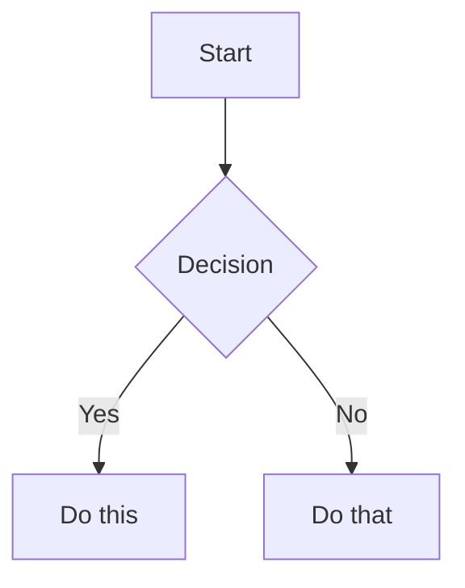
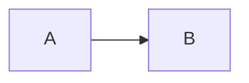

# Obsidian Flavored Markdown Syntax Guide

This reference guide describes the syntax extensions supported by Obsidian. Use this format when creating or editing content in the vault.

## Overview
Obsidian uses a combination of Markdown flavors:
- [CommonMark](https://commonmark.org/)
- [GitHub Flavored Markdown](https://github.github.com/gfm/)
- [LaTeX](https://www.latex-project.org/) for math
- Obsidian-specific extensions (wikilinks, callouts, embeds, etc.)

## Basic Formatting

### Paragraphs and Line Breaks
```markdown
This is a paragraph.

This is another paragraph (blank line between creates separate paragraphs).

For a line break within a paragraph, add two spaces at the end  
or use Shift+Enter.
```

### Headings
```markdown
# Heading 1
## Heading 2
### Heading 3
#### Heading 4
##### Heading 5
###### Heading 6
```

### Text Formatting
| Style | Syntax | Example | Output |
|-------|--------|---------|--------|
| Bold | `**text**` or `__text__` | `**Bold**` | **Bold** |
| Italic | `*text*` or `_text_` | `*Italic*` | *Italic* |
| Bold + Italic | `***text***` | `***Both***` | ***Both*** |
| Strikethrough | `~~text~~` | `~~Striked~~` | ~~Striked~~ |
| Highlight | `==text==` | `==Highlighted==` | ==Highlighted== |
| Inline code | `` `code` `` | `` `code` `` | `code` |

### Escaping Formatting
Use backslash to escape special characters:
```markdown
\*This won't be italic\*
\#This won't be a heading
1\. This won't be a list item
```
Common characters to escape: `\*`, `\_`, `\#`, `` \` ``, `\|`, `\~`

## Internal Links (Wikilinks)

### Basic Links
```markdown
[[Note Name]]
[[Note Name.md]]
[[Note Name|Display Text]]
```

### Link to Headings
```markdown
[[Note Name#Heading]]
[[Note Name#Heading|Custom Text]]
[[#Heading in same note]]
[[##Search all headings in vault]]
```

### Link to Blocks
```markdown
[[Note Name#^block-id]]
[[Note Name#^block-id|Custom Text]]
```

Define a block ID by adding `^block-id` at the end of a paragraph:
```markdown
This is a paragraph that can be linked to. ^my-block-id
```

### Search Links
```markdown
[[##heading]]     Search for headings containing "heading"
[[^^block]]       Search for blocks containing "block"
```

## Markdown-Style Links
```markdown
[Display Text](Note%20Name.md)
[Display Text](Note%20Name.md#Heading)
[Display Text](https://example.com)
[Note](obsidian://open?vault=VaultName&file=Note.md)
```
Note: Spaces must be URL-encoded as `%20` in Markdown links.

## Embeds

### Embed Notes
```markdown
![[Note Name]]
![[Note Name#Heading]]
![[Note Name#^block-id]]
```

### Embed Images
```markdown
![[image.png]]
![[image.png|640x480]]    Width x Height
![[image.png|300]]        Width only (maintains aspect ratio)
```

### External Images
```markdown


```

### Embed Audio & PDF
```markdown
![[audio.mp3]]
![[document.pdf#page=3]]
```

### Embed Search Results
````markdown
```query
tag:#project status:done
```
````

## Callouts

### Basic Callout
```markdown
> [!note]
> This is a note callout.

> [!info] Custom Title
> This callout has a custom title.
```

### Foldable Callouts
```markdown
> [!faq]- Collapsed by default
> ...

> [!faq]+ Expanded by default
> ...
```

### Supported Callout Types
- `note`, `abstract`, `info`, `todo`, `tip`, `success`, `question`, `warning`, `failure`, `danger`, `bug`, `example`, `quote`

## Lists

### Unordered & Ordered
```markdown
- Item 1
- Item 2
  - Nested

1. First
2. Second
```

### Task Lists
```markdown
- [ ] Incomplete task
- [x] Completed task
```

## Quotes
```markdown
> This is a blockquote.
> > Nested quote.
```

## Code

### Inline & Blocks
````markdown
`inline code`

```javascript
function hello() {
  console.log("Hello");
}
```
````

## Tables

```markdown
| Header 1 | Header 2 |
|----------|----------|
| Cell 1   | Cell 2   |
| [[Link\|Text]] | Escape pipes |
```

## Math (LaTeX)

### Inline & Block
```markdown
Inline: $e^{i\pi} + 1 = 0$

Block:
$$
\int_a^b f(x) dx
$$
```

## Diagrams (Mermaid)

````markdown

````

## Footnotes & Comments

```markdown
Footnote[^1]
[^1]: Content

%% This is a comment %%
```

## Properties (Frontmatter)

Metadata must be at the very top of the file, enclosed in `---`.

```yaml
---
title: My Note Title
date: 2024-01-15
tags:
  - project
  - important
aliases:
  - My Note
cssclasses:
  - custom-class
status: in-progress
---
```

## Tags & HTML

```markdown
#tag #nested/tag

<span style="color: red;">HTML is supported</span>
```

## Complete Example

````markdown
---
title: Project Alpha
tags:
  - project
status: in-progress
---

# Project Alpha

> [!important] Deadline
> Due on ==Jan 30==.

## Tasks
- [x] Plan
- [ ] Execute

## Architecture

````
